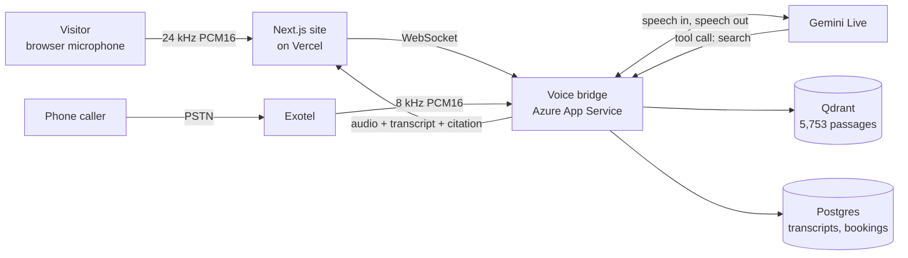
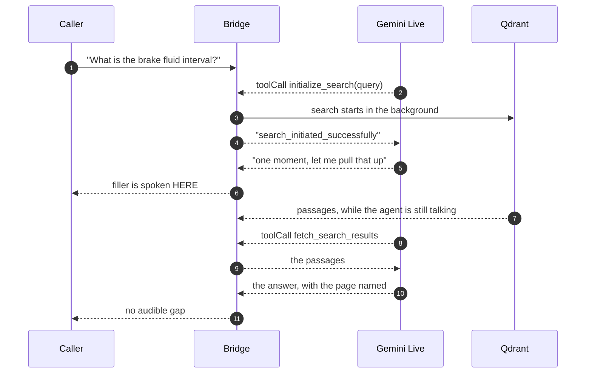
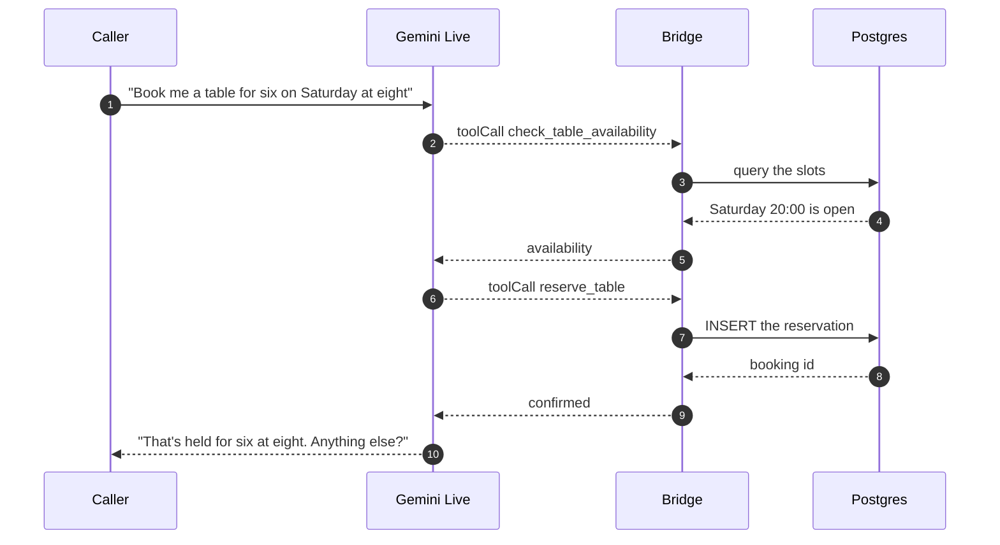
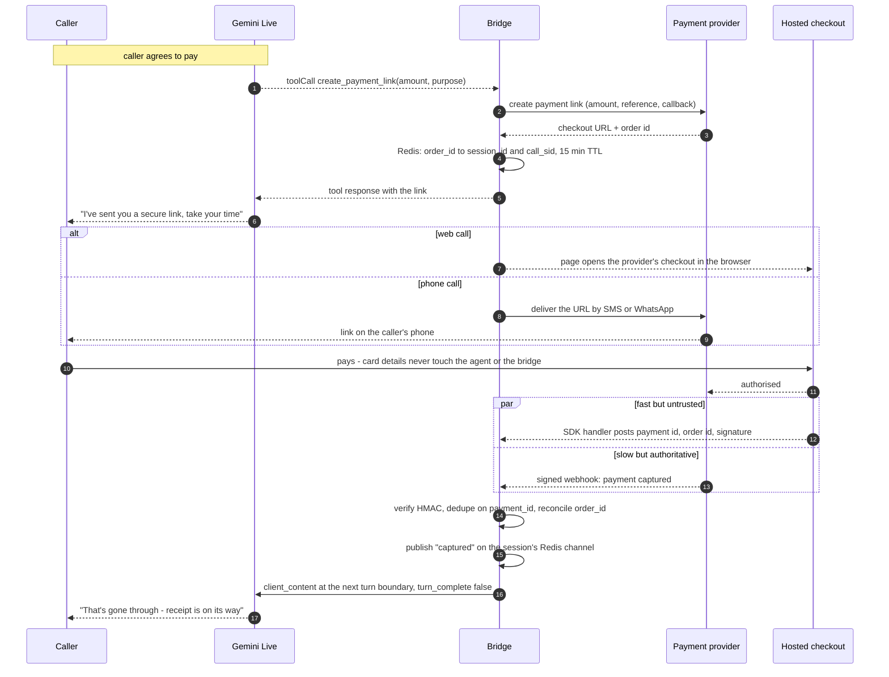
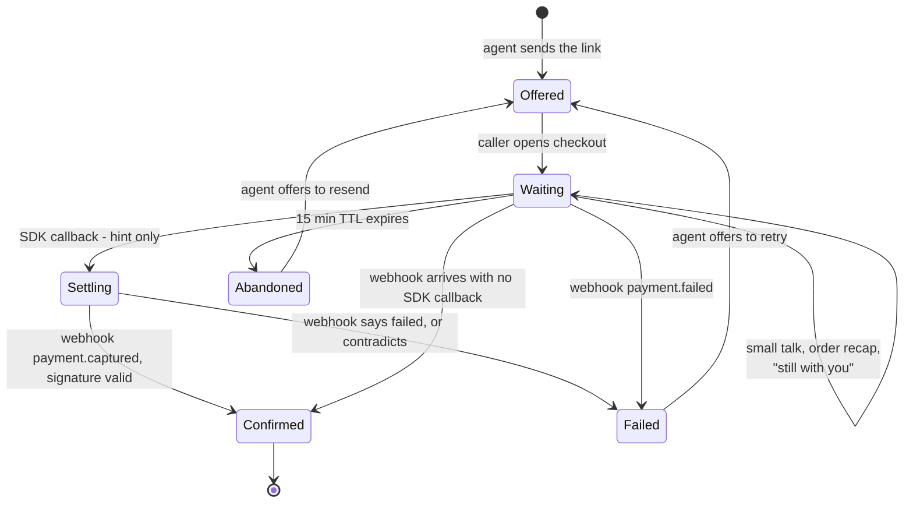
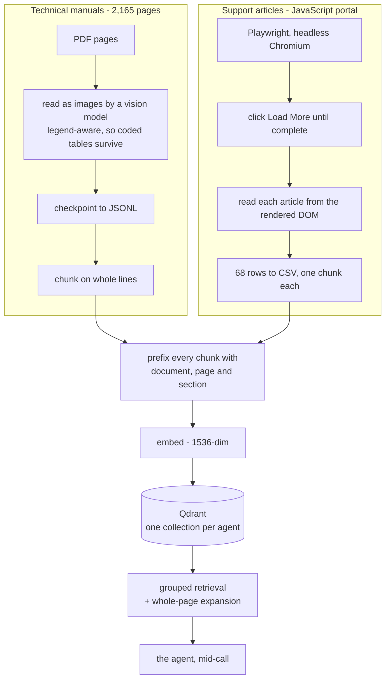
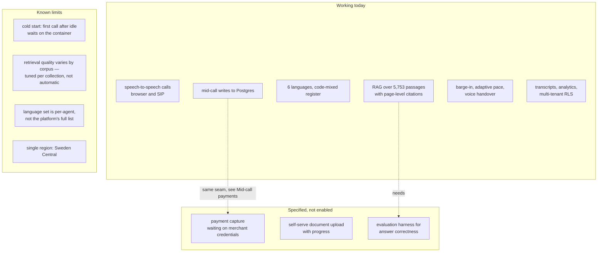

# Appello

Voice agents that answer on the first ring — and answer out of your documents
rather than out of a language model's memory.

**Live:** [appello-ai.vercel.app](https://appello-ai.vercel.app)

Appello is two things in one repository:

| | |
| --- | --- |
| `src/` | The Next.js site, including a **Try it** panel that places a real call to a real agent from the browser. |
| `backend/` | The Python voice bridge that serves that call. Realtime speech, retrieval over the customer's own documents, SIP telephony, transcripts and analytics. See **[backend/README.md](backend/README.md)** for the full architecture. |

Nothing on the site is a mock-up of the backend. The **Document search** agent
is answering from a live vector store of 5,753 passages of vehicle service
documentation while you listen, and the panel says so explicitly on the rare
path where it falls back to a recording.



The full architecture — the two-phase search that hides retrieval latency behind
speech, how the manuals were read out of PDFs, which Azure deployment does what
— is in **[backend/README.md](backend/README.md)**.

## What it demonstrates

**Grounded answers, spoken.** Ask the Document search agent for a brake-fluid
replacement interval and it searches 5,753 indexed passages, then reads the
interval back exactly as the manual prints it and names the document and page it
came from. Every figure is quoted, never rounded, never inferred.

**Dialect, not translation.** For Hindi, Tamil and Telugu the agent speaks the
register a service engineer actually uses on the phone — the sentence in the
caller's language with part names, units and grades left in English — rather
than a literary translation that is harder for a technician to follow.

**Everything is traceable.** A wrong answer is a document you can fix, not a
black box you have to trust.

## Search that does not stall the call

A realtime model that calls a tool and then waits goes silent, and the caller
hears dead air — the single most common way a voice agent gives itself away.
Appello splits the lookup in two and fills the gap with speech.



The retrieval cost is spent underneath speech the model generated for exactly
that purpose. The same trick is what makes the next section practical.

## Mid-call tool calls

Tool calls execute **inside** the live session, not after it. The agent decides
to act, the backend acts, and the agent speaks the result of that action in its
next breath — all while the caller is still on the line.



Four of these are live today — `check_table_availability`, `reserve_table`,
`pre_order_food` and `record_lead_qualification` — and every one writes to
Postgres during the call.

## Mid-call payments

A payment is not just one more tool call, and it is worth being precise about
why: the call is **synchronous** and the payment is **asynchronous**. The agent
asks, the caller leaves to pay on somebody else's checkout page, and the answer
comes back minutes later through a completely different channel. The agent has
to stay useful across that gap and then react to an event that arrives from
outside the conversation.

### The full path



### Why two signals, and which one is the truth

The browser SDK's handler fires the instant the checkout closes, which is fast
and feels immediate — but it runs on the caller's machine and can be forged or
simply never fire, because they closed the tab. The webhook is signed by the
provider and is the only thing worth trusting, but it can lag by seconds.

So the two are used for different jobs. The SDK callback is a *hint* that lets
the agent start talking — *"looks like that's gone through, let me just
confirm"* — and the webhook is what actually settles it. If the webhook never
arrives, or contradicts, the agent corrects itself rather than having confirmed
a payment that did not happen. Confirming from the SDK callback alone is the
classic way to hand out goods for free.

### Keeping the caller company while it settles

Silence during a payment is worse than silence during a search, because the
caller is anxious and cannot see what the agent can see.



The waiting state is the same problem the two-phase search already solves, one
size larger: the agent has something to say that is not silence, and the
external result folds into the conversation when it lands.

### Where the event enters the live session

This is the part with a real constraint, and the codebase already ran into it
for a different feature. A Gemini Live session cannot simply be interrupted:
pushing `client_content` mid-audio stalls the turn. The existing voice-handover
code injects at a **turn boundary** with `turn_complete: false`, so the new fact
folds into the agent's next reply instead of becoming its own utterance and
cutting the caller off. A payment confirmation takes exactly that path.

One thing genuinely has to change. Transcript fan-out today uses an in-process
dictionary of subscribers, which is fine because the websocket and its readers
live in the same worker. A webhook is an inbound HTTP request that may land on a
different worker entirely, so it has to reach the session over **real Redis
pub/sub** rather than a local dict.

### What exists, and what this adds

| Piece | Status |
| --- | --- |
| Tool declared in the live session, model decides when to call | **Built** — four tools do this today |
| `execute_tool` branch performing a real write mid-call | **Built** — reservations, pre-orders, lead capture |
| Hiding a slow round trip behind speech | **Built** — the two-phase search pattern |
| Injecting an external fact at a turn boundary | **Built** — used by voice handover |
| Redis keyed state with TTL | **Built** — session cache and KB cache |
| `create_payment_link` tool and its branch | New — one declaration, one branch |
| Provider client: create link, deliver by SMS or WhatsApp | New — one adapter per provider |
| `POST /webhooks/payments` with signature verification and idempotency | New — there are no webhook routes today |
| Session channel over Redis pub/sub rather than an in-process dict | New — needed for cross-worker delivery |
| Abandonment timeout and resend | New |

### Deliberately out of scope

The agent never hears, handles or stores card details. Payment happens on the
provider's hosted checkout, which keeps card data off this service entirely and
keeps PCI scope where it belongs. An agent that reads a card number back to
confirm it would be a liability, not a feature.

### Provider-agnostic by design

Nothing above is specific to one payment provider. Every gateway in this market
exposes the same four things — create a payment link or order, host the
checkout, fire a client-side callback, and post a signed server-side webhook —
so the provider sits behind a single adapter. Swapping PhonePe for Razorpay, or
running both, changes the adapter and the signature-verification routine and
touches nothing else: not the tool declaration, not the waiting state machine,
not the way the confirmation enters the live session.

That matters more than it sounds. The parts that are hard to get right — not
confirming from an untrusted client callback, surviving a webhook that arrives
after the caller has stopped talking, injecting a fact into a live session
without cutting the caller off — are provider-independent, and they are the
parts already proven in this codebase.

### This is not a paper design

The payment half of it is already running in production in another product built
by the same team, against **PhonePe**, and it is the same shape end to end:

| Piece | How it works there |
| --- | --- |
| Initiate | A callable function creates the order and registers the webhook URL as the provider's callback. |
| Checkout | A native PhonePe SDK plugin takes the payer to hosted checkout. Card data never reaches the application. |
| Client callback | The app reports back when checkout closes — and the server **re-queries the provider's order-status endpoint** rather than believing it. |
| Server webhook | A plain HTTP endpoint verifies `X-VERIFY`, an `SHA256(payload + salt)` signature with a salt index, and rejects anything that fails. |
| Reconcile | Payment and order records move to `completed` / `confirmed` together, keyed on the transaction id, so a duplicate delivery is harmless. |
| Failure | An explicit failure path marks the payment `failed` rather than leaving it pending forever. |

The "treat the client callback as a hint and confirm server-side" rule described
above is not aspiration — it is what that integration already does, and it is
the part most people get wrong.

### Status

**Not wired into the voice bridge in this build.** What is missing is the
adapter between two things that both exist: a proven payment flow on one side,
and a live tool-call seam on the other. The remaining work is the *New* rows in
the table above — a tool declaration, an `execute_tool` branch, a webhook route
on this service, and a Redis channel so the confirmation can reach a session
that may be held by a different worker.

Live merchant credentials for this team sit with PhonePe. The provider is one
adapter behind the interface, so a different gateway changes the create-link
call and the signature check and nothing else.

## How the documents get in

Two corpora, two very different problems, one collection format.



The manuals could not be read as plain text: maintenance schedules are
legend-coded tables whose symbol definitions live on a *different page*, so a
page read in isolation produces confident nonsense. The support portal had no
HTML to fetch at all — listing and article bodies are painted by client-side
JavaScript, so a real browser was the only thing that could see them.

That bracketed header on every chunk is what lets the agent say *"that's from
the Maintenance Manual, page 122"* instead of just asserting a number.

## Where this sits

Enterprise voice-agent platforms in this market are largely English-and-Hindi
first, with other Indian languages handled as translation layered over one
flattened voice, and with answers that come from a prompt rather than from a
document you can point at. Three things here are deliberately different.

**Regional language as dialect, not translation.** Six languages on the
document-search agent, each with its own greeting and its own register rules.
The agent understands the caller in their language, searches in English because
the documents are in English, and answers back code-mixed the way a working
engineer actually speaks — *"brake fluid ko aap eighty thousand kilometre pe
replace karna hai"* — rather than in textbook Hindi that is harder to follow.

**Retrieval built for a real corpus.** Grouped retrieval and whole-page
expansion exist because flat top-k over 5,753 chunks demonstrably returned the
wrong manual. Answers are quoted exactly and carry their source.

**Actions during the call, not after it.** The tool seam is live, and a
transaction is an increment on it rather than a rebuild.

## What works, and what doesn't yet

Being straight about the edges, because a demo that oversells is worse than a
smaller honest one.



| Limit | Why, and what it would take |
| --- | --- |
| **Payments not enabled** | The flow is designed end to end and every mechanism it needs is already running here; no payment adapter is wired up yet. The provider sits behind a single adapter, so this is one integration rather than an architectural change. See *Mid-call payments*. |
| **Cold start** | Azure App Service B1 sleeps when idle, so the first call after a quiet period waits several seconds on the container. An always-on tier or a warming ping removes it. |
| **Retrieval tuning is per-corpus** | The grouping and page-expansion settings that make the manuals work were chosen *for* the manuals. A new corpus needs its own pass; there is no automatic tuner. |
| **Language set is per-agent** | The platform speaks many more than any one agent offers. The picker deliberately shows only the languages an agent has a real greeting and override for. |
| **No answer-correctness harness** | Retrieval is verified by hand today. Regression testing against a labelled question set is the obvious next piece. |
| **Single region** | Everything runs in Sweden Central, so callers in India pay that round trip. Regional deployment is a configuration change, not an architectural one. |

## Running it

```bash
npm install
npm run dev          # http://localhost:3000
```

With no configuration the site talks to the hosted bridge, so the live call
works out of the box. To develop against a bridge on your own machine:

```bash
cd backend
python3 -m venv .venv && source .venv/bin/activate
pip install -r requirements.txt
cp .env.example .env          # fill in at least GEMINI_API_KEY
python main.py                # http://localhost:8000
```

```bash
echo "NEXT_PUBLIC_VOICE_BRIDGE_URL=ws://localhost:8000" > .env.local
```

The panel reads the bridge's `/health` on load and only offers a live call when
it answers; otherwise it plays a recorded conversation and labels it as one.

## Layout

```
src/app/                 Routes, global styles, fonts
src/components/          Sections, navigation, the WebGL voice field
src/components/try/      The call panel: TrySection, Transcript, useCall
src/lib/voiceClient.ts   WebSocket + Web Audio client for the bridge
src/lib/verticals.ts     The agents, their languages, sources and fallbacks
src/lib/signatures.ts    Per-language visual signatures for the voice field
backend/                 The Python voice bridge — see backend/README.md
```
