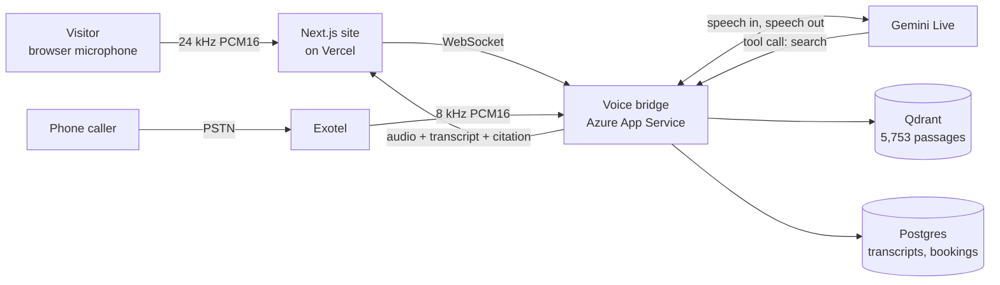
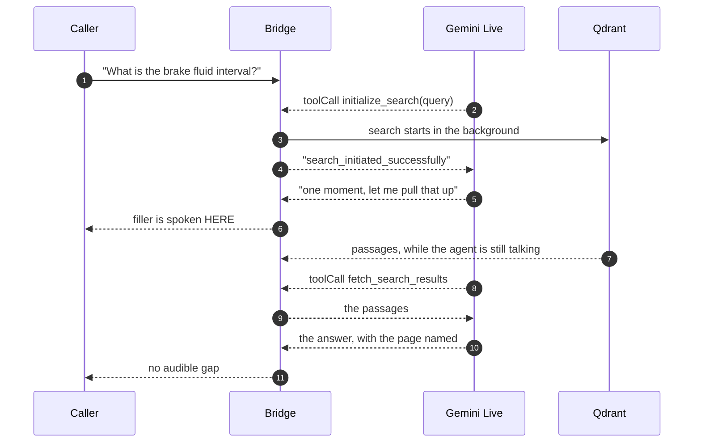
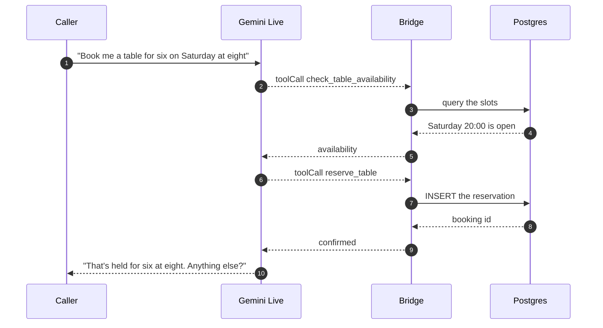
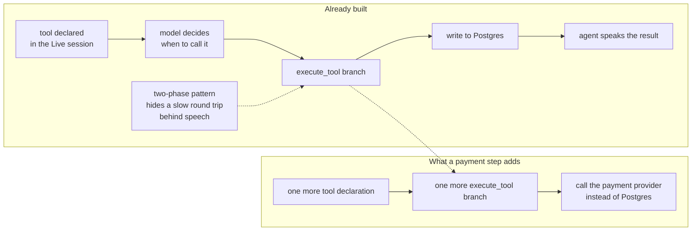
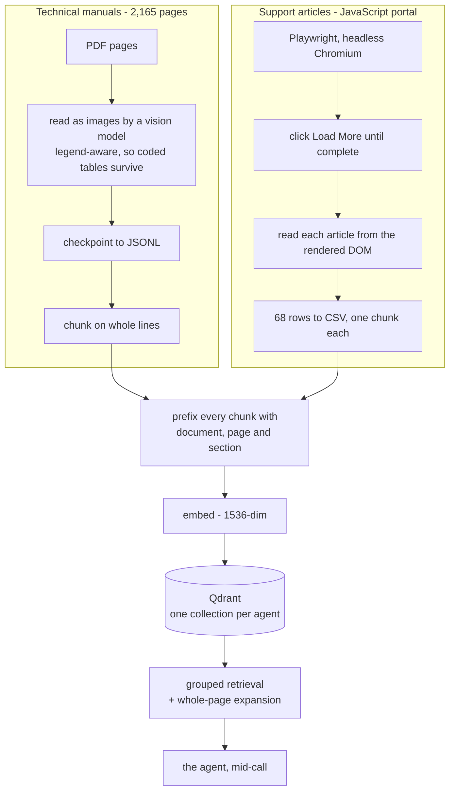
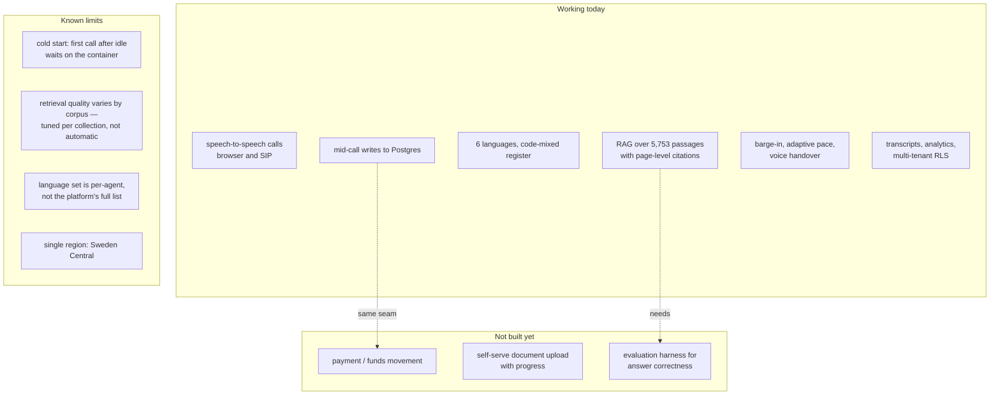

# Appello

Voice agents that answer on the first ring — and answer out of your documents
rather than out of a language model's memory.

**Live:** [appello-ai.vercel.app](https://appello-ai.vercel.app)

Appello is two things in one repository:

| | |
| --- | --- |
| `src/` | The Next.js site, including a **Try it** panel that places a real call to a real agent from the browser. |
| `backend/` | The Python voice bridge that serves that call. Realtime speech, retrieval over the customer's own documents, SIP telephony, transcripts and analytics. See **[backend/README.md](backend/README.md)** for the full architecture. |

Nothing on the site is a mock-up of the backend. The **Document search** agent
is answering from a live vector store of 5,753 passages of vehicle service
documentation while you listen, and the panel says so explicitly on the rare
path where it falls back to a recording.



The full architecture — the two-phase search that hides retrieval latency behind
speech, how the manuals were read out of PDFs, which Azure deployment does what
— is in **[backend/README.md](backend/README.md)**.

## What it demonstrates

**Grounded answers, spoken.** Ask the Document search agent for a brake-fluid
replacement interval and it searches 5,753 indexed passages, then reads the
interval back exactly as the manual prints it and names the document and page it
came from. Every figure is quoted, never rounded, never inferred.

**Dialect, not translation.** For Hindi, Tamil and Telugu the agent speaks the
register a service engineer actually uses on the phone — the sentence in the
caller's language with part names, units and grades left in English — rather
than a literary translation that is harder for a technician to follow.

**Everything is traceable.** A wrong answer is a document you can fix, not a
black box you have to trust.

## Search that does not stall the call

A realtime model that calls a tool and then waits goes silent, and the caller
hears dead air — the single most common way a voice agent gives itself away.
Appello splits the lookup in two and fills the gap with speech.



The retrieval cost is spent underneath speech the model generated for exactly
that purpose. The same trick is what makes the next section practical.

## Mid-call tool calls

Tool calls execute **inside** the live session, not after it. The agent decides
to act, the backend acts, and the agent speaks the result of that action in its
next breath — all while the caller is still on the line.



Four of these are live today — `check_table_availability`, `reserve_table`,
`pre_order_food` and `record_lead_qualification` — and every one writes to
Postgres during the call.

**Mid-call transactions sit on exactly this seam.** A payment step is the same
three pieces: a declared tool, a branch in `execute_tool`, and a call out to the
provider instead of to Postgres.



The hard parts are already solved: the model reliably decides when to call, the
write lands mid-call, and the two-phase pattern above is proven at hiding a slow
round trip behind speech — which is exactly what a payment authorisation needs.
**No payment or funds-movement tool is wired up today**; what exists is the
mechanism it would plug into.

## How the documents get in

Two corpora, two very different problems, one collection format.



The manuals could not be read as plain text: maintenance schedules are
legend-coded tables whose symbol definitions live on a *different page*, so a
page read in isolation produces confident nonsense. The support portal had no
HTML to fetch at all — listing and article bodies are painted by client-side
JavaScript, so a real browser was the only thing that could see them.

That bracketed header on every chunk is what lets the agent say *"that's from
the Maintenance Manual, page 122"* instead of just asserting a number.

## Where this sits

Enterprise voice-agent platforms in this market are largely English-and-Hindi
first, with other Indian languages handled as translation layered over one
flattened voice, and with answers that come from a prompt rather than from a
document you can point at. Three things here are deliberately different.

**Regional language as dialect, not translation.** Six languages on the
document-search agent, each with its own greeting and its own register rules.
The agent understands the caller in their language, searches in English because
the documents are in English, and answers back code-mixed the way a working
engineer actually speaks — *"brake fluid ko aap eighty thousand kilometre pe
replace karna hai"* — rather than in textbook Hindi that is harder to follow.

**Retrieval built for a real corpus.** Grouped retrieval and whole-page
expansion exist because flat top-k over 5,753 chunks demonstrably returned the
wrong manual. Answers are quoted exactly and carry their source.

**Actions during the call, not after it.** The tool seam is live, and a
transaction is an increment on it rather than a rebuild.

## What works, and what doesn't yet

Being straight about the edges, because a demo that oversells is worse than a
smaller honest one.



| Limit | Why, and what it would take |
| --- | --- |
| **Cold start** | Azure App Service B1 sleeps when idle, so the first call after a quiet period waits several seconds on the container. An always-on tier or a warming ping removes it. |
| **Retrieval tuning is per-corpus** | The grouping and page-expansion settings that make the manuals work were chosen *for* the manuals. A new corpus needs its own pass; there is no automatic tuner. |
| **Language set is per-agent** | The platform speaks many more than any one agent offers. The picker deliberately shows only the languages an agent has a real greeting and override for. |
| **No answer-correctness harness** | Retrieval is verified by hand today. Regression testing against a labelled question set is the obvious next piece. |
| **Single region** | Everything runs in Sweden Central, so callers in India pay that round trip. Regional deployment is a configuration change, not an architectural one. |

## Running it

```bash
npm install
npm run dev          # http://localhost:3000
```

With no configuration the site talks to the hosted bridge, so the live call
works out of the box. To develop against a bridge on your own machine:

```bash
cd backend
python3 -m venv .venv && source .venv/bin/activate
pip install -r requirements.txt
cp .env.example .env          # fill in at least GEMINI_API_KEY
python main.py                # http://localhost:8000
```

```bash
echo "NEXT_PUBLIC_VOICE_BRIDGE_URL=ws://localhost:8000" > .env.local
```

The panel reads the bridge's `/health` on load and only offers a live call when
it answers; otherwise it plays a recorded conversation and labels it as one.

## Layout

```
src/app/                 Routes, global styles, fonts
src/components/          Sections, navigation, the WebGL voice field
src/components/try/      The call panel: TrySection, Transcript, useCall
src/lib/voiceClient.ts   WebSocket + Web Audio client for the bridge
src/lib/verticals.ts     The agents, their languages, sources and fallbacks
src/lib/signatures.ts    Per-language visual signatures for the voice field
backend/                 The Python voice bridge — see backend/README.md
```
