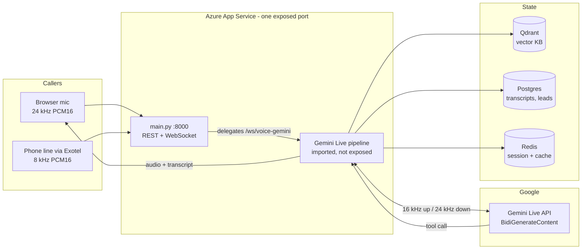
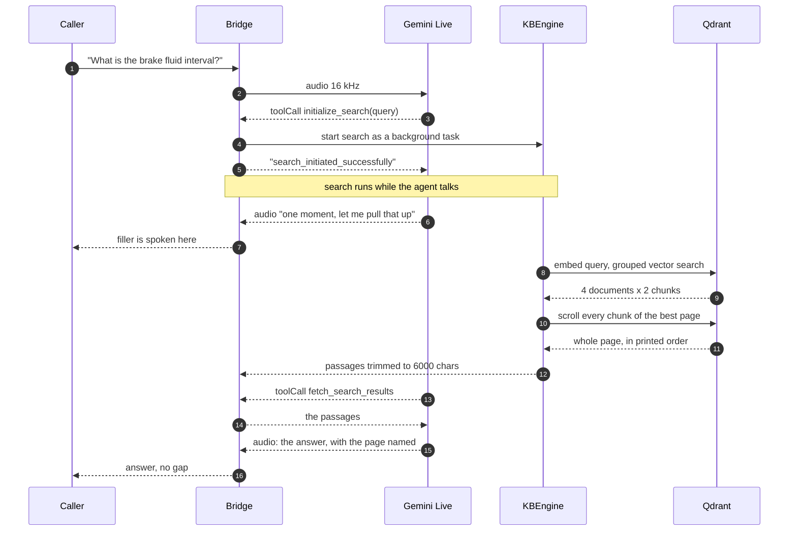
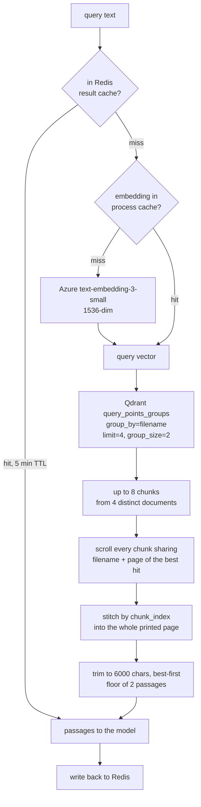
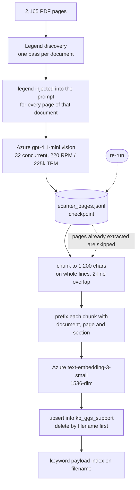
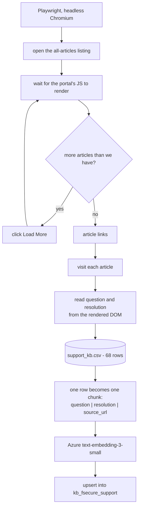
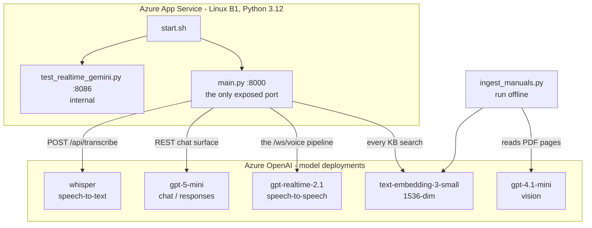
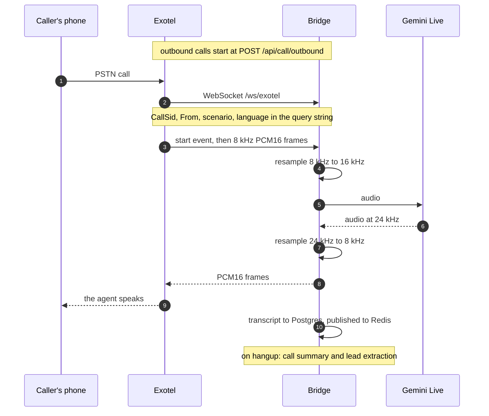
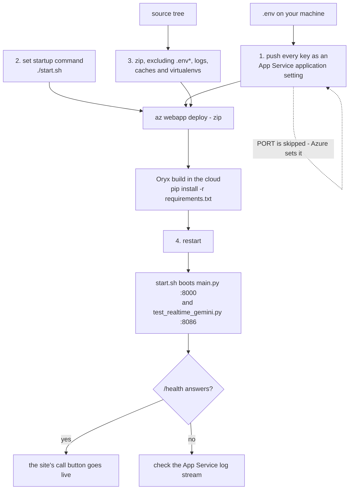

# Appello Voice Bridge

The realtime backend behind [appello-ai.vercel.app](https://appello-ai.vercel.app).
It is a Python service that sits between a caller — a browser microphone or a
SIP phone line — and a realtime speech model, and it grounds what the agent says
in a vector search over the customer's own documents.

Everything the marketing site demonstrates is served from this directory. The
"Document search" agent on the site is `ggs_support` below, and its answers come
out of a live Qdrant collection of 5,753 passages, not out of a script.



Two callers, one pipeline. The browser streams 24 kHz and hears 24 kHz back;
the phone path resamples at both ends. Everything the agent says that is a fact
about a document came out of Qdrant during the call.

---

## 1. Processes and ports

`start.sh` boots two FastAPI apps:

| Process | Port | Role |
| --- | --- | --- |
| `main.py` | 8000 | The public app. REST API, the Azure OpenAI Realtime pipeline, the Exotel telephony pipelines, and a mount of the Gemini pipeline at `/ws/voice-gemini`. |
| `test_realtime_gemini.py` | 8086 | The Gemini Live pipeline. Runs as its own app for local work; in production it is imported by `main.py` rather than exposed. |

Azure App Service publishes exactly one port, so **`main.py` is the only
process reachable from the internet**. `main.py:/ws/voice-gemini` delegates
straight into `test_realtime_gemini.voice_pipeline`, which is why the hosted
bridge and a local `python test_realtime_gemini.py` serve the same handler at
two different paths. The frontend's `checkBridge()` reads `/health` and picks
the right one:

* `{"status":"ok","service":"appello-bridge"}` → `main.py` → use `/ws/voice-gemini`
* `{"status":"healthy","service":"gemini-live-bridge",...}` → standalone → use `/ws/voice`

## 2. Endpoints

### WebSocket

| Path | Pipeline | Caller |
| --- | --- | --- |
| `/ws/voice-gemini` | Gemini Live | Browser, 24 kHz PCM16 |
| `/ws/voice` | Azure OpenAI Realtime + Sarvam TTS | Browser, 24 kHz PCM16 |
| `/ws/exotel`, `/ws/exotel/` | Gemini Live | Exotel SIP, 8 kHz PCM16 |
| `/ws/exotel-azure`, `/ws/exotel-azure/` | Azure OpenAI Realtime | Exotel SIP, 8 kHz PCM16 |

### REST

`api_routes.py` mounts 41 routes; `call_analytics.py` and `tenant_routes.py`
add the analytics and tenancy surfaces. The ones that matter to the site:

| Route | Purpose |
| --- | --- |
| `GET /health` | Liveness. The frontend gates the live-call button on this. |
| `POST /api/call/outbound` | Places an outbound Exotel call. |
| `GET /api/call/{call_sid}/transcript-stream` | SSE transcript for a call in flight. |
| `POST /kb/query` | Query a knowledge-base collection directly, without a call. |
| `POST /kb/files/upload`, `POST /kb/files/{id}/reindex` | Add documents to an agent's collection. |
| `GET /analytics/calls`, `GET /dashboard/metrics` | Post-call analytics. |

## 3. Wire protocol (browser path)

The client opens the socket and sends **one JSON config message**, then streams
raw binary frames. Everything the server sends back is JSON.

```jsonc
// → client, first message
{ "type": "config",
  "scenario": "ggs_support",     // which agent
  "language": "en-IN",           // see §4 for the two accepted forms
  "accent":   "indian",          // optional; only restaurant_booking branches on it
  "voice":    "Charon",          // optional; overrides the per-agent default
  "agent_id": "…" }              // optional; loads a tenant-owned agent row
```

```jsonc
// → client, thereafter: binary PCM16 mono @ 24 kHz, ~40 ms per frame

// ← server
{ "type": "audio",      "data": "<base64 PCM16 mono @ 24 kHz>" }
{ "type": "transcript", "role": "user" | "assistant", "text": "…" }
{ "type": "status",     "status": "listening" | "speaking" }
{ "type": "clear" }                    // barge-in: drop queued audio
{ "type": "rate",       "value": 1.05 }// playback-rate hint from PaceTracker
{ "type": "error",      "message": "…" }
```

Sample rates: the browser captures and plays at 24 kHz. Gemini Live accepts
16 kHz input, so the uplink is downsampled in `downsample_24k_to_16k`; its
output is already 24 kHz and is forwarded to the browser untouched. The Exotel
path resamples 8 kHz ↔ 24 kHz at both ends (`audio_utils.py`).

If no config message arrives within 10 seconds the pipeline continues on
defaults rather than hanging the caller.

## 4. Agents

An agent is a `scenario_key` that selects a system prompt, a greeting, a voice,
a language policy and a tool set. Five are wired to the site; a sixth serves
endpoint-security support.

| `scenario` | Persona / desk | Languages | Grounding | Tools |
| --- | --- | --- | --- | --- |
| `ggs_support` | Gaurav — Fleet Service Desk | `en-IN` `en-US` `hi-IN` `ta-IN` `te-IN` `ja-JP` `de-DE` | Qdrant `kb_ggs_support`, 5,753 chunks | `initialize_search`, `fetch_search_results` |
| `fsecure_support` | Mohit — Endpoint Security Desk | same set | Qdrant `kb_fsecure_support`, 68 scraped articles | same, plus `set_voice_preference` |
| `restaurant_booking` | David — The Royal Plate | English (Indian / American accent) | System prompt | `check_table_availability`, `reserve_table`, `pre_order_food`, `get_my_bookings` |
| `real_estate_lead` | Maya — Urban Rise | Tamil | System prompt | `record_lead_qualification` |
| `payment_followup` | Mohan — Easy Loans | English, Hindi, Tamil, Telugu | System prompt + Postgres loan record | — |
| `feedback_agent` | Ratan — Sunrise Company | Tamil | System prompt | `record_feedback` |

**Two forms of the `language` field.** The four prompt-grounded agents take a
bare language name (`english`, `hindi`, `tamil`, `telugu`). The two support
desks take a BCP-47 code (`en-IN`, `ja-JP`, …) because they key a greeting table
and a language-override block off it. The frontend carries this distinction as
`languageFormat: "bcp47"` on the vertical.

For a non-English caller the support desks add a language override that does one
thing worth calling out: **the search query is always written in English**, then
the answer is spoken back in the caller's language. The manuals are in English,
and a query in another script retrieves the wrong document and produces a
confident answer from an unrelated manual. For Hindi, Tamil and Telugu the
prompt also pins a code-mixed register — the sentence in the caller's language
with part names, units and grades left in English — because that is how service
engineers actually speak on the phone.

## 5. Retrieval — how "document search" works

### 5.1 Two-phase tool call

A realtime model that calls a tool and waits goes silent, and the caller hears
dead air. The support desks therefore get **two** tool declarations instead of
one:

1. `initialize_search(query)` — starts the Qdrant search as a background task and
   returns immediately with `search_initiated_successfully`.
2. The model speaks a short filler ("one moment, let me pull up those details").
3. `fetch_search_results()` — awaits the task started in step 1 and returns the
   passages.

The retrieval cost is spent underneath the filler, so the caller never hears the
gap. The prompt forbids a second filler after step 3 — the model goes straight
to the answer.



The dead air a naive implementation would produce sits between steps 4 and 11.
Here it is filled with speech the model generated for exactly that purpose.

### 5.2 Grouped retrieval

`kb_ggs_support` mixes a handful of one-page briefs with several
thousand-page manuals. Flat top-k lets the big manuals bury the small ones: a
"how do I jump start the truck" query filled every slot with mediocre diagnostic
pages and never surfaced the two-chunk `jump start.pdf` at all. The search for
this collection is therefore configured (in `tools.py`) as:

```python
"ggs_support": {
    "top_k": 4,             # best 4 documents…
    "group_by": "filename", # …grouped by source document
    "group_size": 2,        # 2 chunks from each
    "expand_top_pages": 1,  # best match served as its COMPLETE source page
}
```

`expand_top_pages` matters on a support line. A periodic-inspection table or a
repair procedure spans several chunks; without it the agent reads out half a
schedule and stops, which is worse than saying nothing.



Three caches sit on that path, each for a different reason. The embedding cache
is per-process and unbounded in TTL because a query's vector never changes. The
Redis result cache is 5 minutes, because the collection can be re-ingested
underneath it. Collection existence is cached after the first confirmed sighting
— it used to be re-checked on every search, which put a second round trip to
Frankfurt in front of every query.

### 5.3 Context budget

Tool responses stay in the Live session's history, so every search permanently
enlarges the context for the rest of the call. Left unbounded, five questions in
this corpus accumulated roughly 19,000 tokens of manual text, and time-to-first-
token climbed until the agent audibly stalled after "let me check" from about
the fourth question on. `_KB_CONTEXT_BUDGET = 6000` characters is spent
top-down: the best passage always goes through intact, weaker supporting
passages are dropped, and a floor of two passages is kept regardless.

### 5.4 Failing loudly rather than quietly

A transient DNS or connection fault must not read as *"we have no documentation
on that"*. Mid-call the two are indistinguishable to the caller, and the agent
apologises for a gap that does not exist. So a search failure retries three
times with backoff, rebuilding the Qdrant client each time in case the
connection pool is poisoned, and then raises `KBUnavailable` — which the tool
layer reports as a broken lookup, not as a miss. The synchronous Qdrant client
is called through `asyncio.to_thread`, because calling it directly would block
the event loop for the whole round trip and stall the audio in both directions.

### 5.5 Citations

Every stored chunk is prefixed with a bracketed header naming its document, page
and section — `[Maintenance Manual — page 122 — 48. BRAKE FLUID]`. The
prompt tells the agent to use it to name its source aloud, and never to read the
bracket verbatim. Superseded documents carry a `[LEGACY DOCUMENT …]` prefix so
first-generation figures are announced as such rather than quoted as current.

## 6. Ingestion pipelines

### 6.1 Technical manuals — `ingest_manuals.py`

The commercial-vehicle service library is 2,165 pages of PDF. Plain text extraction is
not enough: maintenance schedules are legend-coded tables (`• L L L | L: 24`)
whose symbol definitions sit on a *different page* from the table, so a page read
in isolation produces confident nonsense — a dot column gets read as a distance
column and every interval shifts one place.

The pipeline:

1. **Legend discovery.** One pass per document finds the symbol legend; it is
   then injected into the prompt for every page of that document.
2. **Vision extraction.** Each page is rendered and read by Azure OpenAI
   `gpt-4.1-mini` into one-fact-per-line prose. Concurrency 32, rate-limited to
   220 RPM / 225k TPM against the deployment's measured 250/250k budget.
3. **Checkpointing.** Output is written to `ecanter_pages.jsonl` before anything
   is embedded, so a failure during embedding never re-spends the vision budget.
   Re-running skips pages already in the checkpoint.
4. **Chunking.** 1,200 characters, assembled from whole lines with 2 lines of
   overlap, so a maintenance-interval sentence is never cut in half.
5. **Embedding and upsert.** Azure OpenAI `text-embedding-3-small`, 1536-dim,
   cosine, into `kb_ggs_support`. Deletion is per-filename rather than
   per-collection, so re-ingesting one manual leaves the rest intact.



The checkpoint is the load-bearing part. Vision extraction over 2,165 pages is
the expensive step; writing it to JSONL before anything is embedded means a
failure during embedding costs nothing to recover from, and a re-run resumes
instead of re-spending the budget.

A keyword payload index on `filename` is created here; the grouped search in
§5.2 depends on it.

Run modes: `--extract-only`, `--embed-only`, `--files "a.pdf,b.pdf"`,
`--tag-legacy`. `verify_manuals.py` checks the result.

The source PDFs are licensed OEM manuals and are **not** committed to this
repository. Point `SOURCE_DIR` at your own copies.

### 6.2 Support articles — `crawl_support_kb.py`

The endpoint-security desk is grounded in a public support knowledge base that
renders entirely in client-side JavaScript, so there is no HTML to fetch and no
API to call.

1. **Playwright** (headless Chromium) loads the all-articles listing, waits for
   the portal's JavaScript to render it, and clicks *Load More* until the
   article set is complete.
2. Each article link is visited and its question and resolution body extracted
   from the rendered DOM.
3. **68 articles** were captured this way and written to CSV
   (`question, resolution, source_url`).
4. An enrichment pass normalises them, and `KBEngine.ingest` embeds and upserts
   them into `kb_fsecure_support`.



There is no HTML to fetch and no API to call — the listing and every article
body are painted by client-side JavaScript, so a browser is the only thing that
can see them. `ingest_csv` then turns each row into a single searchable chunk
rather than splitting it, because a support article is already the right size
for one answer.

```bash
pip install playwright && playwright install chromium
export SUPPORT_KB_BASE_URL=...  SUPPORT_KB_ARTICLES_URL=...
python crawl_support_kb.py
```

The scraped CSVs are not committed — rerun the crawler to regenerate them.

### 6.3 Generic path — `kb_engine.py` / `ingest_briefs.py`

`KBEngine` is the shared interface: `initialize`, `ingest`, `search`,
`delete_by_filename`, `drop`. Chunking defaults to 1,500 characters with 200 of
overlap; collections are named `kb_<scenario_key>` and created on demand with
1536-dim cosine vectors. Documents uploaded through `POST /kb/files/upload` go
through this path.

## 7. Adaptive voice and pace — `voice_adapt.py`

Two dependency-light utilities, both running inline on the 16 kHz PCM already
being forwarded to Gemini, neither touching the network:

* **`GenderDetector`** estimates speaker gender from fundamental frequency using
  FFT autocorrelation (tens of microseconds per frame). It reports only when its
  verdict *changes*, and treats the 155–165 Hz band as undecidable so it does not
  flip-flop on low-voiced women and high-voiced men. Where enabled, the agent may
  offer to hand the caller to a differently-voiced colleague; the swap replays
  the recent transcript and carries over any knowledge-base passage already
  retrieved, so the new voice does not re-greet or re-invent the answer.
* **`PaceTracker`** turns the caller's observed speaking rate into a playback
  rate for the agent's audio, sent to the client as `{"type":"rate"}`. Bounded to
  0.9–1.1 by default, because playback-rate resampling shifts pitch and a wider
  range stops the agent sounding like one person.

Both are opt-in: `GENDER_ADAPTIVE_VOICE` and `ADAPTIVE_PACE`.

## 8. Azure — what runs where

Azure carries two unrelated jobs here: it hosts the service, and it supplies
every non-Gemini model the service calls. They are separate resources and it is
worth keeping them straight.



| Deployment | Used by | For |
| --- | --- | --- |
| `text-embedding-3-small` | `kb_engine.py`, both ingestion scripts | The one model on the hot path of every call — it embeds each search query, and embedded every chunk that was ever stored. 1536-dim, cosine. |
| `gpt-4.1-mini` | `ingest_manuals.py` | Reading PDF pages as images into one-fact-per-line prose. Offline only; never touched during a call. |
| `gpt-realtime-2.1` | `main.py` `/ws/voice` | The alternative speech-to-speech pipeline, paired with Sarvam TTS. The site uses the Gemini path instead. |
| `gpt-5-mini` | `api_routes.py` `/chat` | The text chat surface for dashboards. |
| `whisper` | `api_routes.py` `/api/transcribe` | One-shot transcription of uploaded audio. |

**Why only one port is public.** App Service publishes a single container port.
`start.sh` boots both apps, so `test_realtime_gemini.py` runs on 8086 inside the
container but is unreachable from outside; `main.py` mounts its pipeline at
`/ws/voice-gemini` and delegates into it. That indirection is the single most
confusing thing about this deployment, and it is why the frontend probes
`/health` to decide which path to open.

**Configuration flows through app settings, not the image.** `deploy.sh` reads
your local `.env` and pushes every key as an App Service application setting,
deliberately skipping `PORT` because Azure manages it. The `.env` file itself is
excluded from the deployment zip, so nothing secret is ever baked into the
artefact.

## 9. Qdrant — the knowledge base

One collection per agent, named `kb_<scenario_key>`, created on demand with
1536-dimension cosine vectors.

| Collection | Contents | Built by |
| --- | --- | --- |
| `kb_ggs_support` | 5,753 chunks from 19 vehicle service documents | `ingest_manuals.py` plus `ingest_briefs.py` |
| `kb_fsecure_support` | 68 scraped support articles, one chunk each | `crawl_support_kb.py` |

Every point carries the same payload, and each field earns its place:

```jsonc
{
  "text":        "[Maintenance Manual — page 122 — 48. BRAKE FLUID] Recommended fluid: …",
  "filename":    "Maintenance Manual.pdf",    // grouping key, and the keyword index
  "title":       "Canter Maintenance Manual", // human name, used in the chunk header
  "page":        122,                         // half of the page-expansion key
  "chunk_index": 3,                           // restores printed order when stitching
  "agent_type":  "ggs_support",
  "category":    "manual",
  "doc_family":  "ecanter"                    // lets one family be re-ingested alone
}
```

`filename` carries a **keyword payload index**, without which
`query_points_groups` cannot group. `filename` + `page` is what `_expand_pages`
filters on to scroll back every sibling chunk, and `chunk_index` is what puts
them in the order they were printed in.

Three Qdrant calls can happen inside one search: `query_points_groups` for the
grouped hit list, then a `scroll` per page being expanded — all off the event
loop via `asyncio.to_thread`, because the client is synchronous and a blocking
round trip to Frankfurt would stall the audio in both directions. Results are
cached in Redis for 5 minutes under a key that includes the grouping parameters,
so changing the search shape cannot serve a result computed under the old one.

## 10. Postgres and Redis

| Store | Used for |
| --- | --- |
| **Postgres** (Neon) | `leads`, `calls`, `transcripts`, `availability_slots`, `bookings`, `knowledge_files`, `restaurant_reservations`, `restaurant_pre_orders`, `restaurant_booking_logs`, `feedback_agent_logs`, `reminder_contacts`. Schema is created on first connect. This is also what mid-call tool calls write to. |
| **Redis** (Upstash) | Session cache, customer pre-hydration for outbound calls, live transcript pub/sub for dashboards, and the 5-minute KB result cache. |

## 11. Telephony — Exotel

The same agents answer a real phone number. Exotel bridges the PSTN call into a
WebSocket and streams 8 kHz PCM16 both ways, which is essentially the only thing
that differs from the browser path.



Four routes serve it: `/ws/exotel` on the Gemini pipeline and `/ws/exotel-azure`
on the Azure Realtime pipeline, each with a trailing-slash twin because Exotel
is inconsistent about it. Scenario, language and caller number arrive as query
parameters rather than in a config message, because Exotel controls the URL and
not the payload — which is why `voice_pipeline` and `exotel_pipeline` read their
configuration from two different places.

`POST /api/call/outbound` places outbound calls through the Exotel flow, and
`GET /api/call/{call_sid}/transcript-stream` streams the transcript to a
dashboard while the call is still running.

None of this is on the path for a browser call — the site pays no telephony cost.

## 12. Multi-tenancy

Tenant-owned rows carry a `tenant_id` and Postgres Row-Level Security enforces
the boundary across 14 tables. An *agent* is a tenant-owned row pointing at one
of the scenario templates above, layering its own voice, language, greeting and
prompt on top; passing `agent_id` in the config message loads it, and a disabled
agent refuses the call with close code 1008.

**RLS is ignored by any role holding SUPERUSER or BYPASSRLS**, which is what
managed Postgres gives you by default. `scripts/provision_tenant_role.py`
creates a non-privileged `appello_app` role; point `DATABASE_URL` at it and keep
the owner URL in `ADMIN_DATABASE_URL` for migrations. The service logs a loud
warning at startup when it detects it is connected as a bypassing role. Full
detail in [TENANCY.md](TENANCY.md); tests in `tests/`.

## 13. Configuration

Copy `.env.example` to `.env`. Only `GEMINI_API_KEY` is strictly required for a
browser call; the rest degrade gracefully.

| Variable | Notes |
| --- | --- |
| `GEMINI_API_KEY` | Google AI Studio key. Required. |
| `GEMINI_LIVE_MODEL` | Default `gemini-3.1-flash-live-preview`. |
| `GEMINI_VOICE` | Default voice; per-agent branches override it (`Charon` for Indian languages, `Orus` otherwise). |
| `PORT` | `main.py`'s port. Azure sets this itself — `deploy.sh` deliberately does not push it. |
| `ALLOWED_ORIGINS` | Comma-separated. A `https://.*\.vercel\.app` regex is always allowed in addition. |
| `DATABASE_URL` / `ADMIN_DATABASE_URL` | Postgres. See §12. |
| `TENANT_RLS_ENFORCED` | `false` keeps the `tenant_id` columns but stops enforcement. Debugging only. |
| `REDIS_URL` | Session cache. |
| `QDRANT_URL` / `QDRANT_API_KEY` | Vector store. |
| `AZURE_OPENAI_EMBEDDING_*` | Embeddings for ingestion and search. |
| `AZURE_OPENAI_*` | Realtime, chat and Whisper deployments for the non-Gemini pipeline. |
| `SARVAM_API_KEY`, `SARVAM_TTS_*` | TTS for the Azure Realtime pipeline. |
| `EXOTEL_*` | SIP telephony. |
| `GENDER_ADAPTIVE_VOICE`, `ADAPTIVE_PACE`, `PACE_MIN`, `PACE_MAX` | See §7. |

`.env` is gitignored and must stay that way — it holds live keys.

## 14. What a call costs

Rates below are Google's published paid-tier pricing for
`gemini-3.1-flash-live-preview`, the model this bridge runs:

| Meter | Rate |
| --- | --- |
| Audio input | **$0.005 / min** (equivalently $3.00 / 1M tokens) |
| Audio output | **$0.018 / min** ($12.00 / 1M tokens) |
| Text input | **$0.75 / 1M tokens** |

### 11.1 One minute of a document-search call

Token volumes are taken from this codebase, not estimated in the abstract: the
Fleet Service Desk system prompt is 6,642 characters, and `_KB_CONTEXT_BUDGET`
caps each search result at 6,000 characters.

| Line | Basis | Cost |
| --- | --- | --- |
| Audio in | The mic streams for the whole call — 1.00 min × $0.005 | **$0.00500** |
| Audio out | The agent holds the floor ~35 s reading a procedure — 0.58 min × $0.018 | **$0.01050** |
| System prompt | 6,642 chars ≈ 1,660 tokens, sent once per session × $0.75/1M | **$0.00125** |
| Retrieved passages | 2 searches × 6,000 chars ≈ 3,000 tokens × $0.75/1M | **$0.00225** |
| Query embeddings | 2 × ~20 tokens on `text-embedding-3-small` | **< $0.00001** |
| | **Model subtotal** | **≈ $0.0190** |

At **₹88 / US$** — set this to your own rate — that is **≈ ₹1.67 per minute** of
model cost.

Two things move that number, both visible in the table. Audio output dominates,
so an agent that reads a full eight-step procedure aloud costs meaningfully more
than one that answers in a sentence; this is the direct price of the "never
compress a procedure" rule in §4. And retrieved passages are the second lever,
which is exactly why the context budget in §5.3 exists — an uncapped search
loop would add roughly $0.001 per extra search *and* slow the agent down.

### 11.2 Adding infrastructure and telephony

Fixed monthly costs amortise over usage, so per-minute infra cost is
`monthly ÷ minutes served`:

| Component | Shape |
| --- | --- |
| Azure App Service B1 (Linux) | Fixed monthly |
| Qdrant Cloud cluster | Fixed monthly |
| Neon Postgres, Upstash Redis | Fixed monthly (usage tiers) |
| Exotel SIP | Per minute, only on phone calls — browser calls pay none of it |

At 10,000 minutes a month a US$40 fixed bill adds $0.004/min (≈ ₹0.35). At 1,000
minutes the same bill adds $0.04/min (≈ ₹3.50) — at low volume the fixed
infrastructure, not the model, is the dominant cost.

**All-in, a one-minute call lands around ₹4–₹5 at demo volumes** and falls
towards ₹2 as the fixed cost spreads. Confirm your own SIP rate and cluster
bills before quoting either figure — those two are inputs here, not measured.

## 15. Where this sits

Enterprise voice-agent platforms in this market are largely English-and-Hindi
first, with regional languages handled as translation over a single flattened
voice. Two things here are deliberately different.

**Dialect and code-mixed speech.** The support desks do not translate an English
answer word-for-word. For Hindi, Tamil and Telugu the prompt pins the register a
service engineer actually uses on the phone: the sentence in the caller's
language, with part names, units, grades and procedure verbs left in English —
*"Sir, brake fluid ko aap eighty thousand kilometre pe replace karna hai, ya
twenty four months pe — jo pehle aaye."* Formal, Sanskritised vocabulary is
explicitly ruled out, because a literary rendering is harder for a working
technician to follow than the code-mixed speech they use daily. The language
picker on the site shows only the languages an agent genuinely has a greeting
and an override for — six for the Fleet Service Desk — rather than a marketing
count.

**Retrieval that survives a large corpus.** Grouped retrieval and whole-page
expansion (§5.2) exist because flat top-k over 5,753 chunks demonstrably
returned the wrong document. The agent quotes intervals and torque figures
exactly as written and names the manual and page it read them from.

**Mid-call tool calls.** The pipeline executes tool calls inside the live
session, not after it: `reserve_table`, `pre_order_food`, `record_feedback` and
`record_lead_qualification` write to Postgres while the caller is still on the
line, and the agent speaks the result of that write in its next breath. The
two-phase search in §5.1 is the same mechanism used to hide latency behind
speech. **No payment or funds-movement transaction is wired to this seam
today** — what exists is the seam itself: a declared tool, an `execute_tool`
branch, and a live database write. A payment step would attach at exactly that
point, and the latency-hiding pattern already proven for search is what would
keep the caller from hearing the wait.

## 16. Running locally

```bash
python3 -m venv .venv && source .venv/bin/activate
pip install -r requirements.txt
cp .env.example .env        # then fill in at least GEMINI_API_KEY
python main.py              # http://localhost:8000
```

Then point the frontend at it, from the repository root:

```bash
echo "NEXT_PUBLIC_VOICE_BRIDGE_URL=ws://localhost:8000" > .env.local
npm run dev
```

Leave `NEXT_PUBLIC_VOICE_BRIDGE_URL` unset and the site talks to the hosted
bridge instead, which is what the Vercel deployment does.

`./start.sh` runs both processes the way production does.
`docker-compose.qdrant.yml` brings up a local Qdrant if you would rather not use
the cloud one.

## 17. Deploying

```bash
./deploy.sh
```

Azure App Service, Linux, Python 3.12, B1, startup command `./start.sh`. The
script reads `.env`, pushes every key as an app setting (skipping `PORT`, which
Azure manages), sets the startup command, zips the source excluding
`.env*`, logs, caches and virtualenvs, deploys with Oryx build enabled, and
restarts the app.



Two things about this that have bitten before. The app settings and the code are
pushed **separately** — a settings-only change still needs the restart in step 4
to take effect, and a code push does not pick up a `.env` edit unless step 1 ran.
And `/health` answering `ok` proves only that `main.py` is up; it says nothing
about whether the Gemini pipeline behind `/ws/voice-gemini` can actually reach
the model. Place a real call before believing a deploy.

Sanity check afterwards:

```bash
curl https://<app>.azurewebsites.net/health
```

## 18. Layout

```
main.py                  Public app: REST, Azure Realtime pipeline, Exotel, /ws/voice-gemini
test_realtime_gemini.py  Gemini Live pipeline, all agent prompts and greetings
api_routes.py            REST API (41 routes)
call_analytics.py        Post-call analytics endpoints
tools.py                 Tool schemas, tool execution, KB search shape and budget
kb_engine.py             Qdrant + embeddings: ingest, search, delete
scenarios.py             Prompt/voice config for the Azure Realtime pipeline
audio_utils.py           Resampling, WAV framing, streaming TTS
language_detect.py       Caller language detection
voice_adapt.py           GenderDetector, PaceTracker
latency.py               Per-turn stage timings
postgres_store.py        Schema and queries
redis_session.py         Session cache and pub/sub
tenancy.py               RLS schema and policies
tenant_store.py          Tenant and agent rows
tenant_context.py        Per-request tenant resolution
tenant_routes.py         Tenant admin API
ingest_manuals.py        Vision-based manual ingestion (§6.1)
crawl_support_kb.py      Playwright article crawler (§6.2)
ingest_briefs.py         Original brief ingestion
verify_manuals.py        Post-ingestion checks
agents/                  Per-agent prompt text
scripts/                 provision_tenant_role.py
tests/                   Tenancy, RLS and regression tests
start.sh  deploy.sh      Boot and deploy
```
